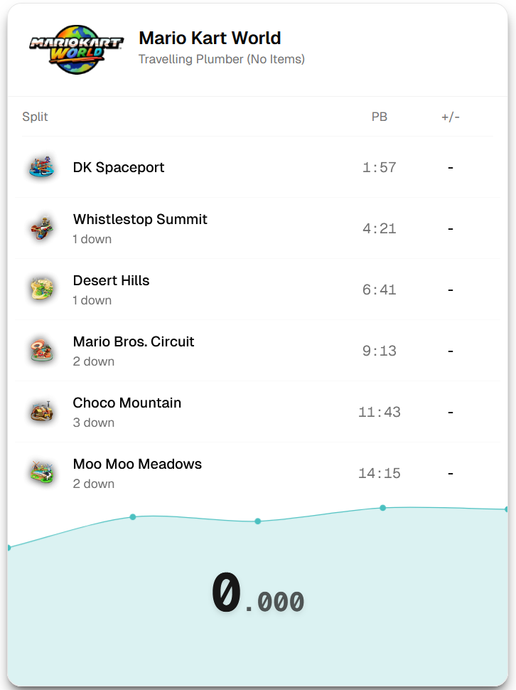

# LiveSplit skin

A skin for LiveSplit implemented using web technologies.



# Usage

Download skin html (index.html) and the LiveSplit JSON server (JSONServer.dll) from [releases page](https://github.com/JaroslawPokropinski/live-split-skin/releases/latest).

Place index.html in an accessible location eg. in documents `.../documents/livesplitskin/index.html`.

Place plugin in `LiveSplit\Components\JSONServer.dll`.

Launch LiveSplit, Edit Layout... > + > Control > JSON Server.

Add LiveSplit skin to OBS > + > Browser Capture

Set to local file, set the size (eg. 1100 x 1600), and the custom css to eg.:

```
html { font-size: 32px; }
body { width: 100%; }
```
